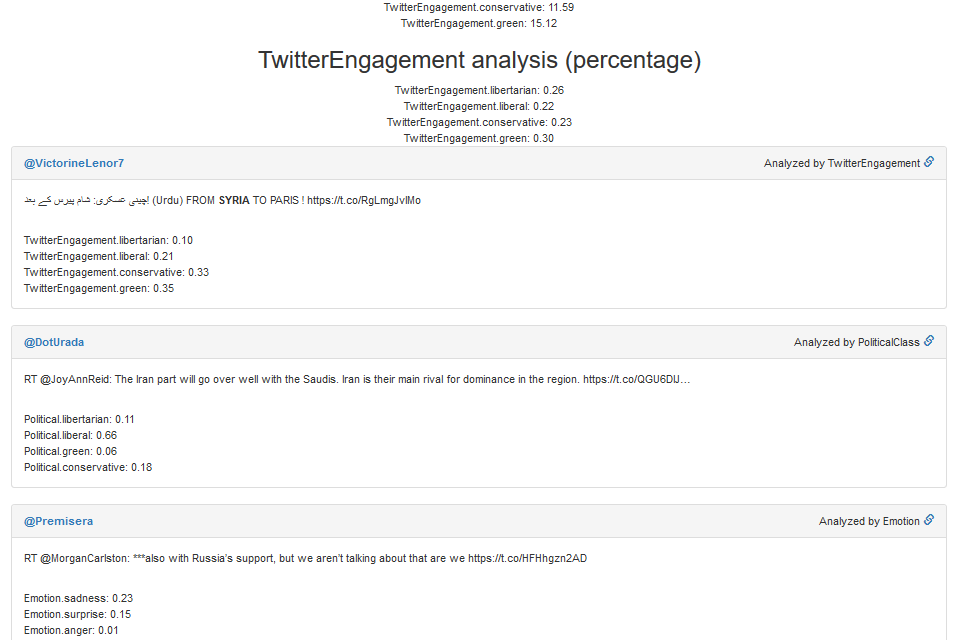
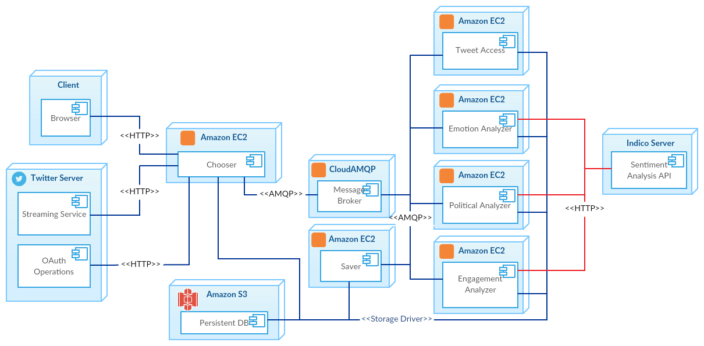
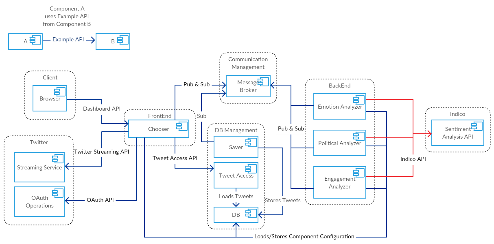

# Tweelytics

Application which fetches real-time tweets based on keywords and geolocation determined by the end user and performs sentiment analysis on them by using the [Indico API](https://indico.io/docs) to predict:
* Audience engagement
* Political leaning
* Emotions

Overall statistics are also calculated to show the average prediction values on all tweets analyzed in the end user session.

Please, find an screenshot below to see how the output for an analyzed tweet would look like:

## Software

Infrastructure-wise, this is the diagram which illustrates the distribution of the nodes and the applications deployed within them:

Regarding the development of the application, the following diagram describes its structure in terms of software components:

Required environment/system parameters:
* Twitter API: ``TWITTER_CONSUMER_KEY``, ``TWITTER_CONSUMER_SECRET``, ``TWITTER_ACCESS_TOKEN``, ``TWITTER_ACCESS_TOKEN_SECRET``.
* Indico API: ``INDICO_APIKEY``.
* MongoDB: ``MONGO_HOST``, ``MONGO_PORT``, ``MONGO_USER``, ``MONGO_PW``, ``MONGO_DB``.
* RabbitMQ: ``RABBITMQ.AMQPURL``, ``RABBITMQ.HOST``, ``RABBITMQ.USER``, ``RABBITMQ.PW``, ``RABBITMQ.VHOST``.

Some Spring application parameters which can be overwritten:
* ``server.port``. Default: 8080/8081/8082 for chooser/processor/saver.
* ``analyzers.mock``. Default: true. If true gets random predictions instead of using the Indico API.
* ``saver.mock``. Default: false. If true mocks the DB.

Gradle can be used to run the chooser, processors and saver.
